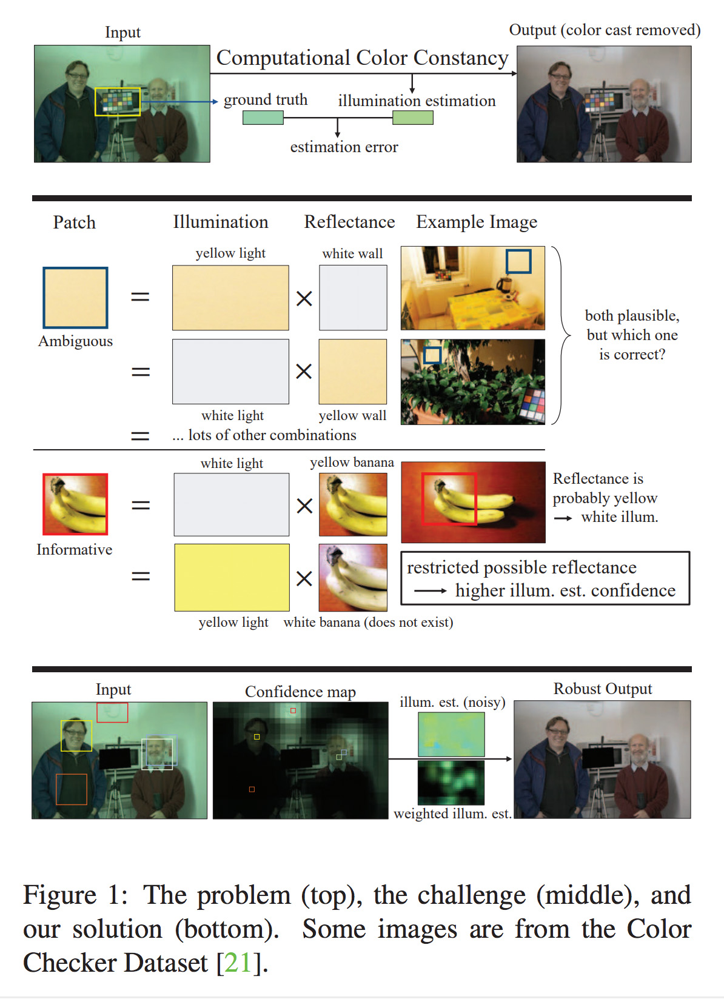
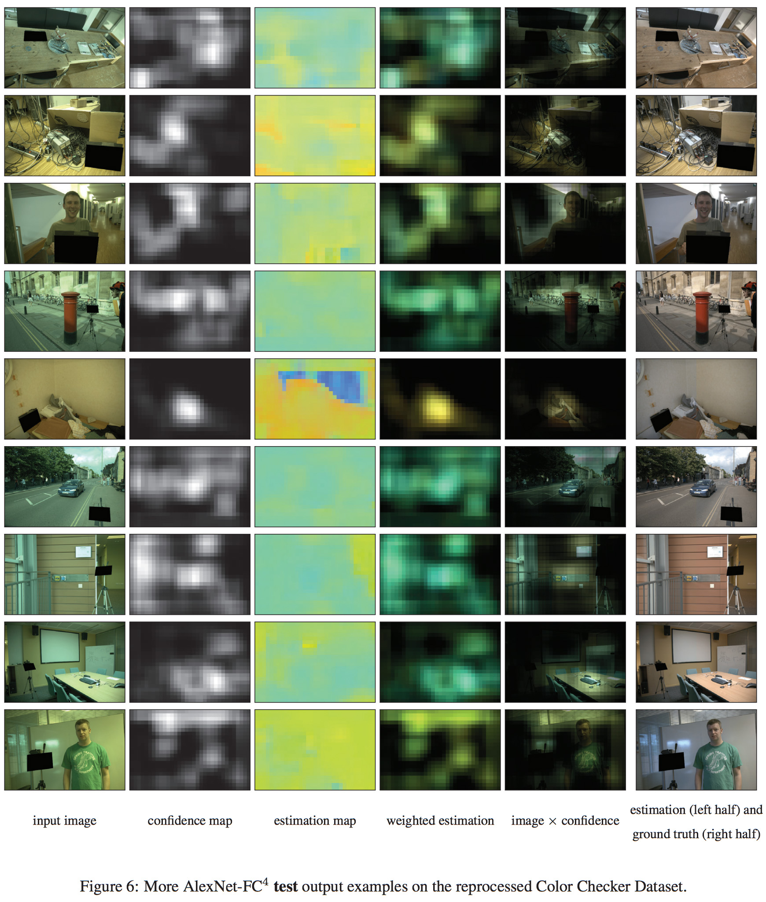
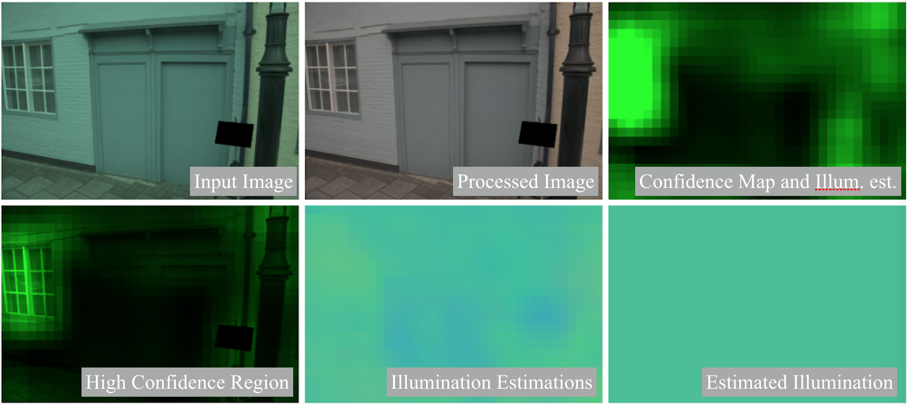

# FC<sup>4</sup>:<br> Fully Convolutional Color Constancy with Confidence-weighted Pooling (CVPR 2017)
#### [[Paper](http://openaccess.thecvf.com/content_cvpr_2017/papers/Hu_FC4_Fully_Convolutional_CVPR_2017_paper.pdf)]
[Yuanming Hu](http://taichi.graphics/me/)<sup>1,2</sup>, [Baoyuan Wang](https://sites.google.com/site/zjuwby/)<sup>1</sup>, [Stephen Lin](https://www.microsoft.com/en-us/research/people/stevelin/)<sup>1</sup>

<sup>1</sup>Microsoft Research <sup>2</sup>Tsinghua University (now MIT CSAIL)


**Change log:**
- July 19, 2018:
   - Improved instructions to reproduce the numbers reported in the paper. (See FAQ **How to reproduce the results reported in the paper?**)
- May 22, 2018:
   - Added some FAQs.
- April 25, 2018: **Released network definition scripts and training instructions**. TODO:
   - Update `config.py` for more datasets and benchmarks.
   - Upgrade `python` version from `2.7` to `3.5+`. **Please use python 2.7 for now.**
- April 15, 2018: Started preparing for code release. 

## The Problem, the Challenge, and Our Solution 


## Visual Results ([More](https://github.com/yuanming-hu/public_files/raw/master/fc4-supp.pdf))


# FAQ
## **Color Constancy and Datasets**

a) **Where to get the datasets?**
 - *Shi's Re-processing of Gehler's Raw Dataset*: [here](http://www.cs.sfu.ca/~colour/data/shi_gehler/)
 - *NUS-8 Camera Dataset*: [here](http://www.comp.nus.edu.sg/~whitebal/illuminant/illuminant.html)

**(The following two sub-questions are FAQs before I release the code - now the script will take care of these details and you don't need to worry unless out of curiosity.)**

b) **The input images look purely black. What's happening?**

The input photos from the ColorChecker dataset are 16-bit `png` files and some image viewer may not support them, as `png`s are typically 8-bit. 
Also, since these photos are linear (RAW sensor activations) and modern displays have a `2.2` gamma value (instead of linear gamma), they will appear even darker when displayed. An exposure correction is also necessary.

c) **I corrected the gamma. Now most images appear green. Is there anything wrong?**

It's common that RAW images appear green. One possible cause is that the color filters of digital cameras may have a stronger activation on the green channel.

d) **What can be done to improve the datasets?**

 - **(More data for deep learning)** The amount of data is relatively small for deep learning.
 - **(More data for accurate comparison)** With only 568 images, the test noise is huge. When three-fold cross-validation is used, if a single test image raises its error from 1 degree to 18 degrees (which is common), it will result in ~0.1 degree average angular error increase. Another issue about the small amount of data is that, the gap between validation set and test set can still be very large. As a result, you may find early stopping on the validation set may not result in a pleasant error on the test set. 
 - **(Validation set)** The (historical) three-fold cross-validation splits do not actually have validation sets. This means people have to tweak hyper-parameters based on the test set. This may not be a serious issue for traditional statistics-based approaches since not many parameters need to be tuned, but the risk of overfitting is becoming higher and higher when the model goes deeper and deeper!
 - **(Quality)** In some images, there are actually more than one light sources in the scene. The illumination difference may be as large as 10 degrees. Since we already achieve < 2 degrees of estimation error, further reducing this number may not provide a significant evidence for algorithm comparison.

Finally, [**The Cube dataset**](http://ipg.fer.hr/ipg/resources/color_constancy#) can be useful for future research!

## FC<sup>4</sup> Training and Testing

a) **Installation**
 
 Please use python2 for now. All dependencies can be installed via `pip`:
 ```
 sudo python2 -m pip install opencv-python tensorflow-gpu scipy
 ```

b) **Data Pre-processing**

[*Shi's Re-processing of Gehler's Raw Dataset*:](http://www.cs.sfu.ca/~colour/data/shi_gehler/)
 - Download the 4 zip files from the website
 - Extract the `png` images into `fc4/data/gehler/images/`, without creating subfolders.
 - `python datasets.py`, and wait for it to finish
 - `python show_patches.py` to view **data-augmented** patches. Press any key to see the next patch. You can use this data provider to train your own network.

c) **Model Training**
 - First, make sure you have preprocessed the data.
 - `python fc4.py train example`, and wait for it to finish. The model will be located at `models/fc4/example/`. `example` here is the model name and you can change it to any other suitable identifier.
 - Note that there are three folds and you need to modify Ln 99 of `config.py` to `FOLD = 1` or `FOLD = 2` for other two folds.

d) **Visualize Confidence Maps**
 You can look at how the confidence map evolves at the folders `models/fc4/example/testXXXXsummaries_0.500000`.

e) **Pretrained models?**

  To get the pretrained models on the ColorChecker dataset, please download [**Pretrained models on the ColorChecker Dataset**](https://github.com/yuanming-hu/fc4/releases/download/pretrained/pretrained_colorchecker.zip), and put the nine files in folder `pretrained`.
 
f) **How to reproduce the results reported in the paper?**
 - Taking the ColorChecker dataset as an example.
 - Please train the three-fold models (make sure you modify `FOLD` to be `0`, `1`, `2` in `config.py`) or download the pretrained models.
 - (Assuming you are using the pretrained models. Modify the path if not.) Test on the ColorChecker dataset (make sure you have preprocessed it):
 ```
 python2 fc4.py test pretrained/colorchecker_fold1and2.ckpt -1 g0 fold0
 python2 fc4.py test pretrained/colorchecker_fold2and0.ckpt -1 g1 fold1
 python2 fc4.py test pretrained/colorchecker_fold0and1.ckpt -1 g2 fold2
 ```
 - Combine the three folds:
 ```
    python2 combine.py outputs/fold0_err.pkl outputs/fold1_err.pkl outputs/fold2_err.pkl
 ```
 - You will see the results
 ```
 25: 0.384, med: 1.160 tri: 1.237 avg: 1.634 75: 3.760 95: 4.850
 ```
 - In comparison to what we reported in the paper:
 
 |                                   | Mean | Median | Tri. Mean | Best 25% | Worst 25% | 95% Quant. |
 |-----------------------------------|------|--------|-----------|----------|-----------|------------|
 | SqueezeNet-FC4 (CVPR 2017 paper)  | 1.65 | 1.18   | 1.27      | 0.38     | 3.78      | 4.73       |
 | SqueezeNet-FC4 (Open source code) | 1.63 | 1.16   | 1.24      | 0.38     | 3.76      | 4.85       |
 
 You can see we get slightly better result except for `95% Quant.`. The difference should be due to randomness (or different TensorFlow version, I am not sure myself...).
 
g) **How to make inference on images based on a trained model?**
 - Test on other images: (e.g. `sample_inputs/a.png`)
 ```
 python2 fc4.py test pretrained/colorchecker_fold1and2.ckpt -1 sample_inputs/a.png
 ```
 
 You will see the results in seconds. Legend **(TODO: this legend doesn't match the latest code!)**:
 

h) **What does the `SEPERATE_CONFIDENCE` option mean? When its value is `False`, does it mean confidence-weighted pooling is disabled?**

Firstly, let's clarify a common misunderstanding of the color constancy problem: the output of a color constancy consists of *three* components. Actually, there are only *two* components (degrees-of-freedom). In some paper, the two components are denoted as `u`/`v` or `temperature`/`tint`. When estimating `R/G/B`, there should be a constraint on the values, either `L1` (`R+G+B=1`) or L2 (`R^2+G^2+B^2=1`).

In our paper, we estimate `R/G/B`. Therefore, for each patch, we should either normalize the `R/G/B` output and estimate another confidence value (which is mathematically more explicit), or directly use the `unnormalized` estimation as normalized `R/G/B` times confidence, as mentioned in paper section 4.1. Either way is fine and confidence-weighting is used because one extra degree of freedom (i.e. confidence) is allowed. If you use `SEPERATE_CONFIDENCE=True`, the former is used; otherwise the latter is used.

If you want to disable confidence-weighted pooling, the correct way is setting `WEIGHTED_POOLING=False`.

i) **How to merge test results on three folds?**

`python2 combine.py [fold0_model_name] [fold1_model_name] [fold2_model_name]`

# Bibtex
```
@inproceedings{hu2017fc,
  title={FC 4: Fully Convolutional Color Constancy with Confidence-weighted Pooling},
  author={Hu, Yuanming and Wang, Baoyuan and Lin, Stephen},
  booktitle={Proceedings of the IEEE Conference on Computer Vision and Pattern Recognition},
  pages={4085--4094},
  year={2017}
}
```

# Related Research Projects and Implementations 
 - [Exposure](https://github.com/yuanming-hu/exposure) (General-purpose photo postprocessing with GANs and reinforcement learning)
 - [FFCC](https://github.com/google/ffcc) (Fast Fourier Color Constancy: an auto white balance solution with machine learning in Fourier space)
 - ...

# Color Constancy Resources
 - [**Color Constancy** by the Image Processing Group @ FER](http://ipg.fer.hr/ipg/resources/color_constancy#)
   **The Cube dataset** may be useful for future research!
 - [**Research Website on Illuminant Estimation** by Arjan Gijsenij and Theo Gevers](http://colorconstancy.com/)
 - (Let me know if you think something else should be here!)

 - (Chinese blog on FC<sup>4</sup> by wy1988) [基于神经网络的颜色恒常性](https://www.cnblogs.com/wangyong/p/9141075.html)

# Acknowledgments 
 - The SqueezeNet model is taken from [here](https://github.com/DeepScale/SqueezeNet). Thank Yu Gu for his great efforts in converting the `Caffe` models into a `TensorFlow`-readable version! 
